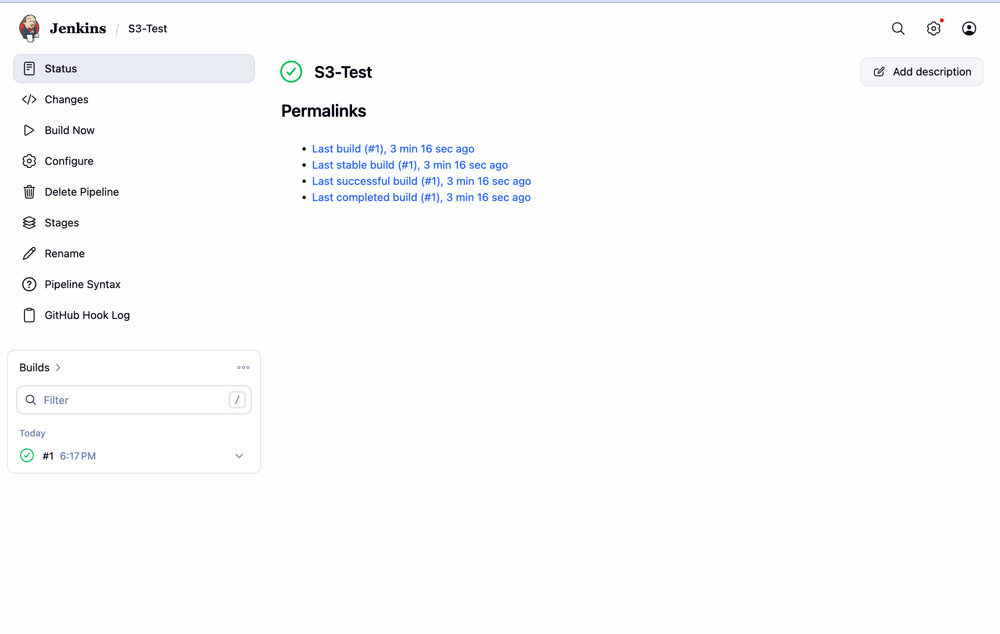

---
tags:
  - BMC
  - AWS
  - homework
name: Homework Week 28
---

# Overview

We'll use an EC2 instance to host jenkins. Once jenkins is configured and installed, we'll use the instance to create a resource in AWS

# Deliverables

- [x] Deploy a jenkins pipeline using a jenkins file
      
