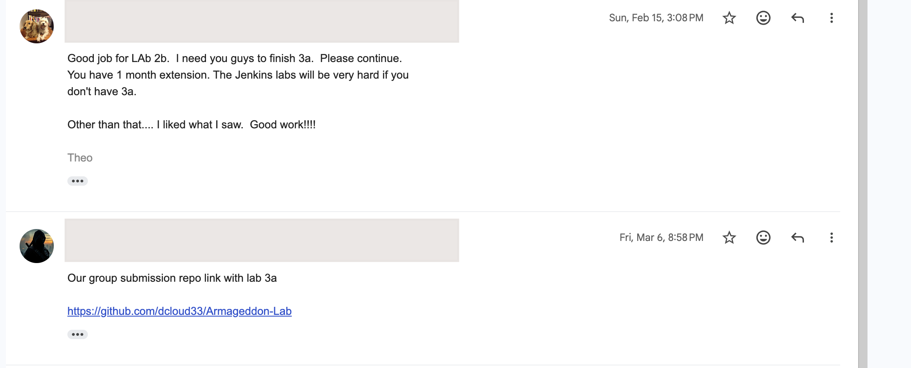
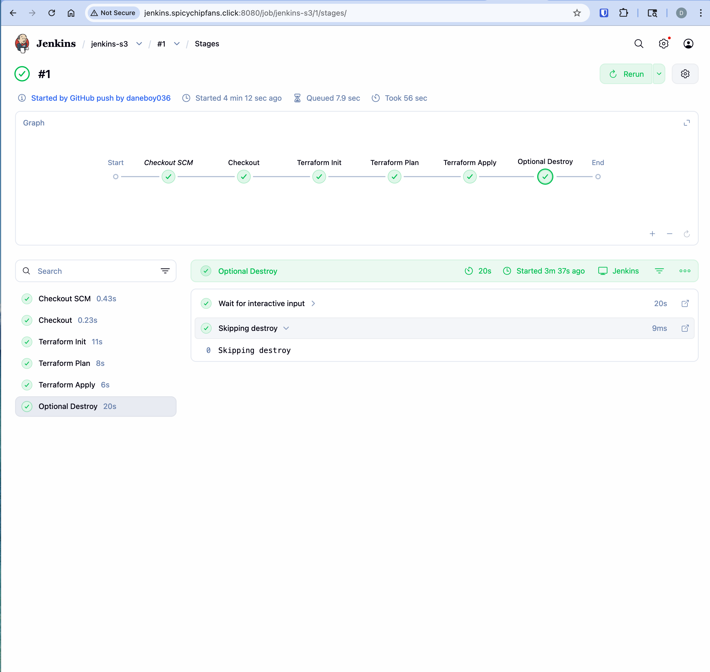
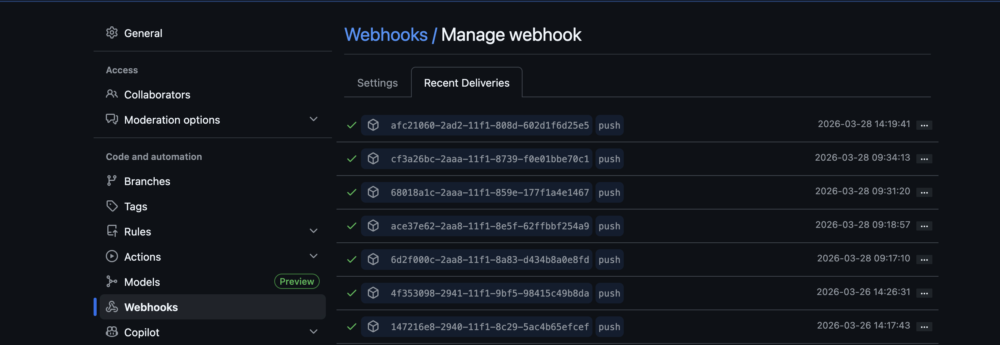
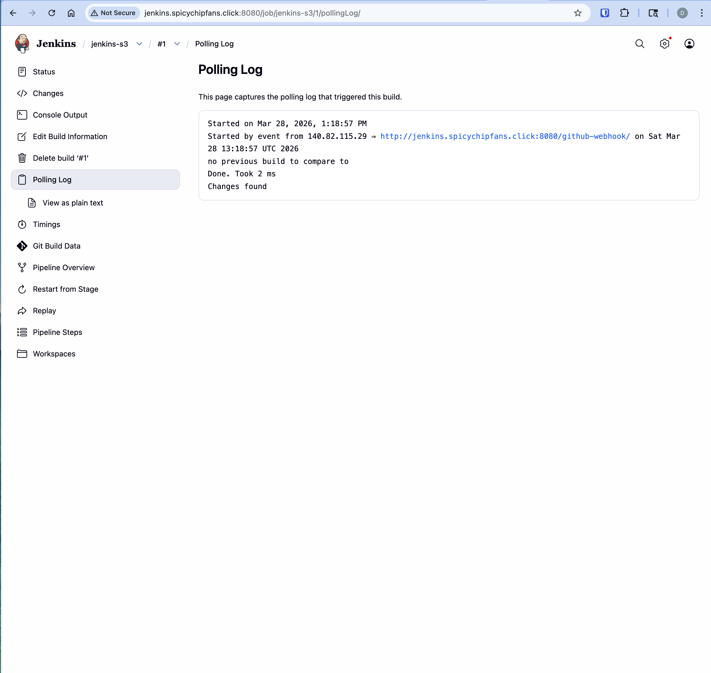
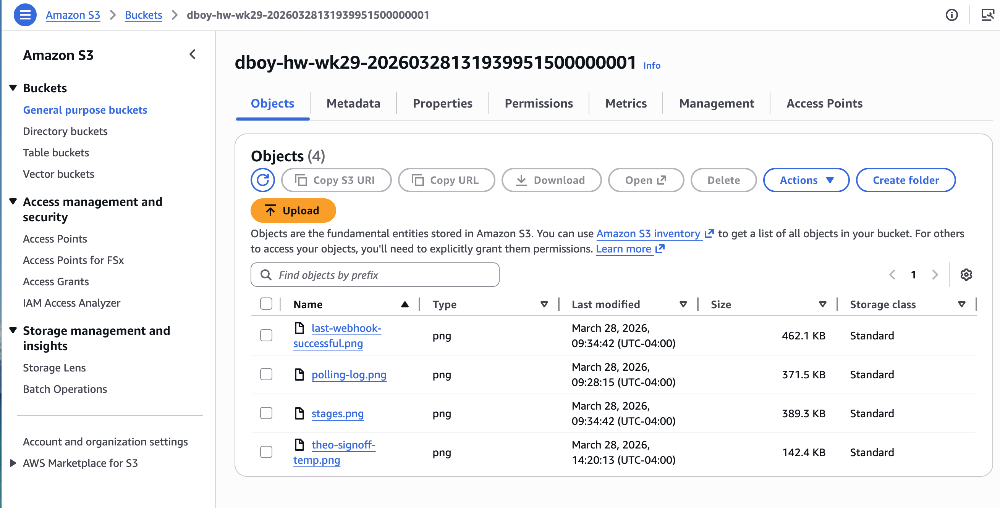

---
tags:
  - BMC
  - AWS
  - homework
name: Homework Week 29
---

# Overview

This is the gut check week.

# Deliverables

- [x] Link to armageddon repo in markdown or text file
      [Armageddon Repo](https://github.com/daneboy036/Armageddon-Lab)
- [x] Screenshot of proof of passing armageddon
      
- [x] Terraform to create s3 bucket and upload artifacts
      [main.tf](../terraform/main.tf)
- [x] Proof of pipeline run in Jenkins
      
- [x] Proof of webhook invocation
      
      
- [x] Files in s3
      
