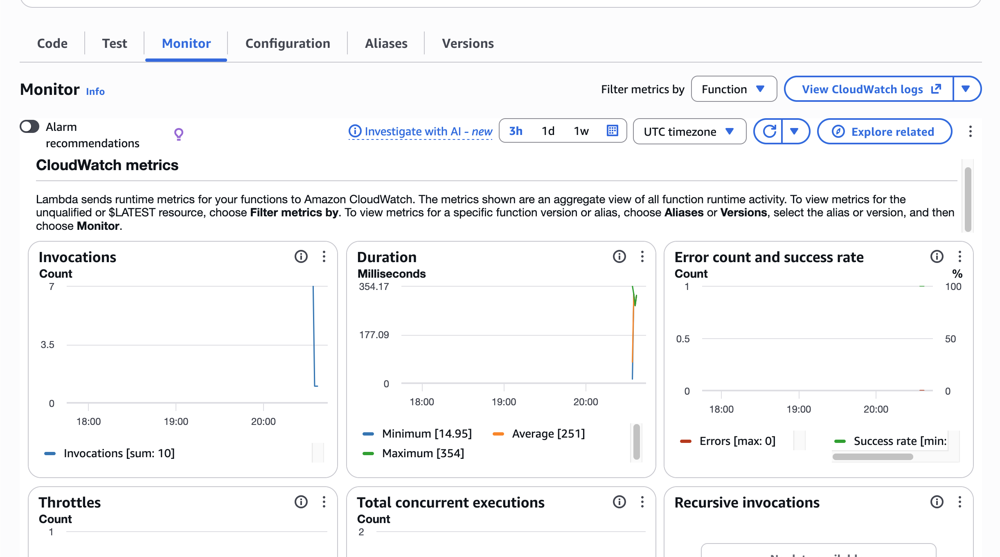

---
tags:
  - BMC
  - AWS
  - homework
name: Homework Week 32
---

# Maarek Section Proof

## Section 17 Quiz


## Section 18 Quiz


## Section 19 Quiz


## Section 20 Quiz


# Lambda Practice

## Lambda Function

```python
import json
import boto3
import os

sns = boto3.client('sns')

topic_arn = os.environ['SNS_TOPIC_ARN']

def lambda_handler(event, context):
	try:
		response = sns.publish(TopicArn=topic_arn, Message='(Change 3) Week 32 Homework Class Lambda Message', Subject='(Change 3) BMC Class 7: Week 32 Lambda')
		return {
		'statusCode': 200,
		'body': json.dumps('Check your email (Change 3)!')
		}
	except Exception as e:
		print(e)
		return {
		'statusCode': 500,
		'body': json.dumps('Could not publish to topic')
		}
```

## Lambda Permissions

Allow Lambda to do `sns:` on your topic

```json
{
  "Version": "2012-10-17",
  "Statement": [
    {
      "Sid": "VisualEditor1",
      "Effect": "Allow",
      "Action": "sns:*",
      "Resource": "<topic arn>"
    }
  ]
}
```

**_Role Permissions_**


## Verifications

**_Invocations_**



**_Email Verification_**


**_SNS Topic_**


**_Function URL_**

