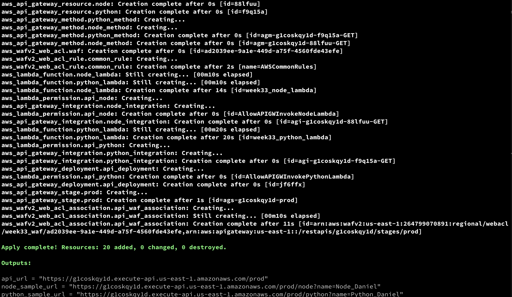
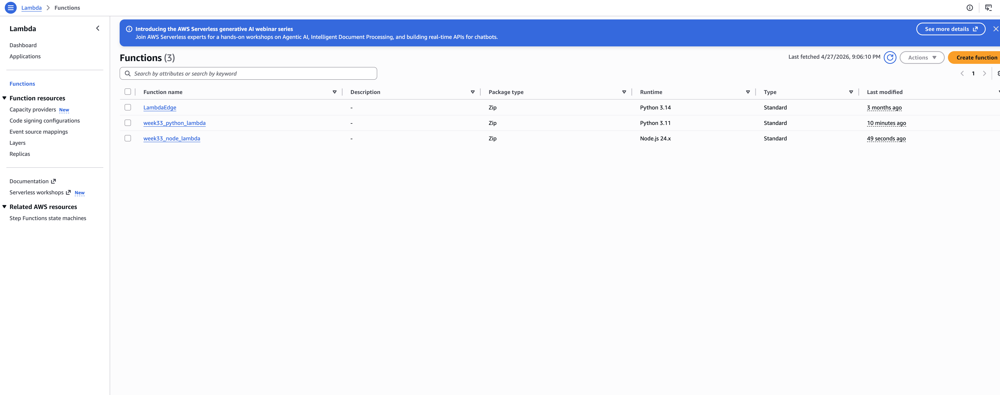
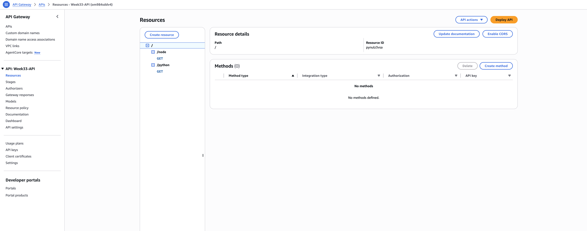
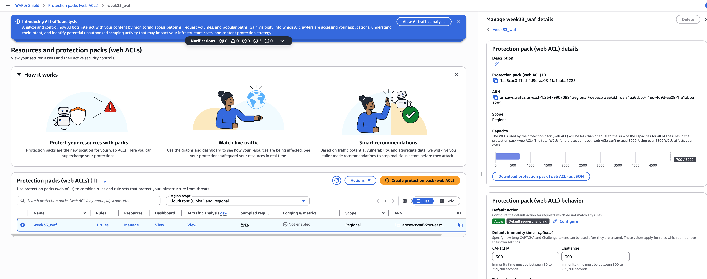
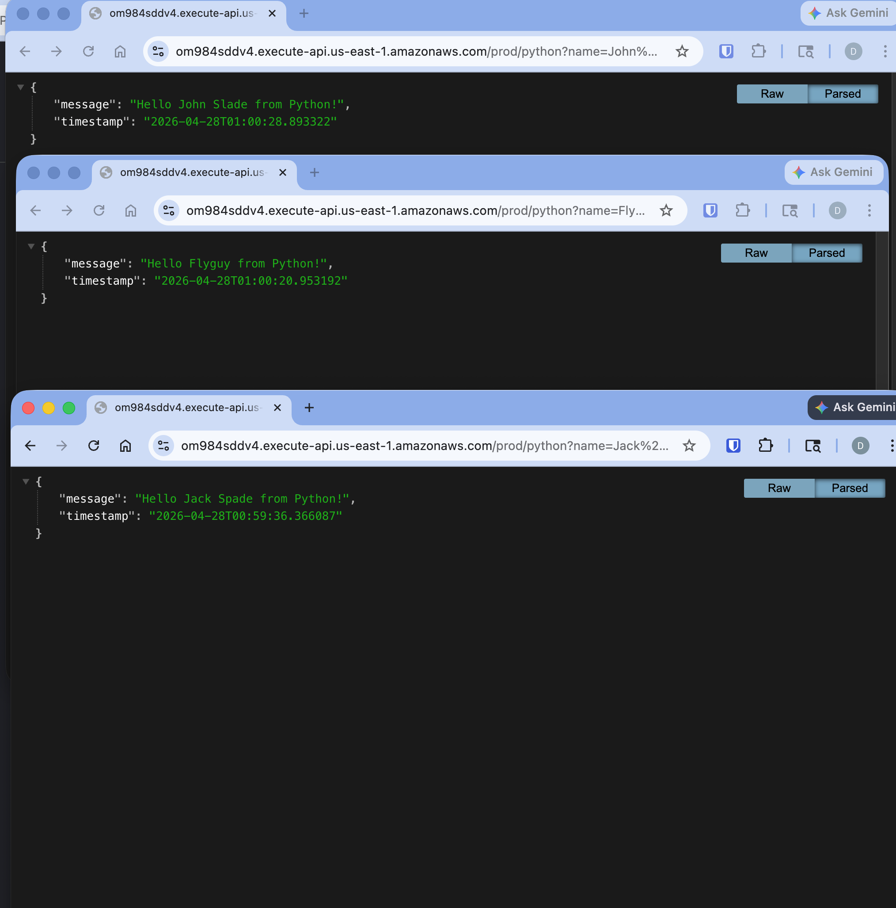
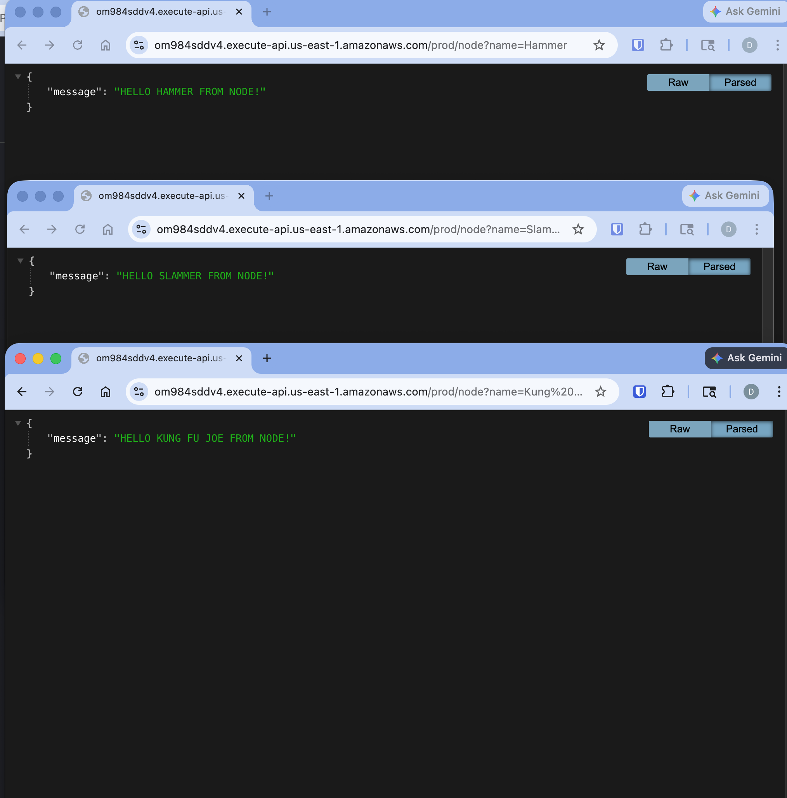
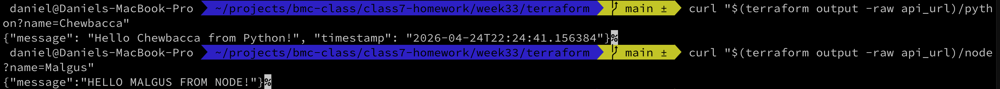
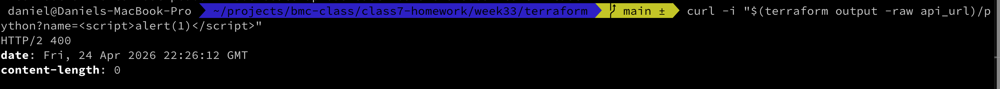

---
tags:
  - BMC
  - AWS
  - homework
  - terraform
  - lambda
  - api-gateway
  - waf
name: Homework Week 33
---

# Overview

We'll build on the work we've been doing with lambda. The lambda functions will be exposed via api gateway and the api gateway will have a WAF associated with it.

# Notes

- lambda test payload:

```json
{
  "queryStringParameters": {
    "name": "The Duke of Earl"
  }
}
```

- WAF isn't suported for `aws_apigatewayv2_api` unless you put CloudFront in front of the api

# Deliverables

- [x] Terraform Apply
      
- [x] Created Lambda Functions
      
- [x] API Gateway
      
- [x] WAF
      
- [x] Python Requests
      
- [x] Node Requests
      
- [x] `curl "$(terraform output -raw api_url)/python?name=Chewbacca"` and `curl "$(terraform output -raw api_url)/node?name=Malgus"`
      

- [x] `curl "$(terraform output -raw api_url)/python?name=<script>alert(1)</script>"`
      
- [x] Why Lambda permission is required
      `API gateway needs permission in order to invoke your lambda function. Lambda functions need permission to interact with AWS services and resources.`

- [x] Difference between integration vs route
      `An integration defines what to do with a request (send to lambda, forward to another api...). Routes tell you which paths are supported. Requests go to API Gateway. If they match a route then they are sent to an integration. If they don't then you get an error.`

- [x] Where WAF sits
      `WAF sits in front of the API gateway. So requests hit the firewall first and then are forwarded to the API gateway if they're not blocked`

- [x] Why Terraform is better than ClickOps
      `Using Terraform (IaC) allows for better reproducability than ClickOps. Terraform also makes it easier to ensure that you tear down any resources that are not longer necessary.`
