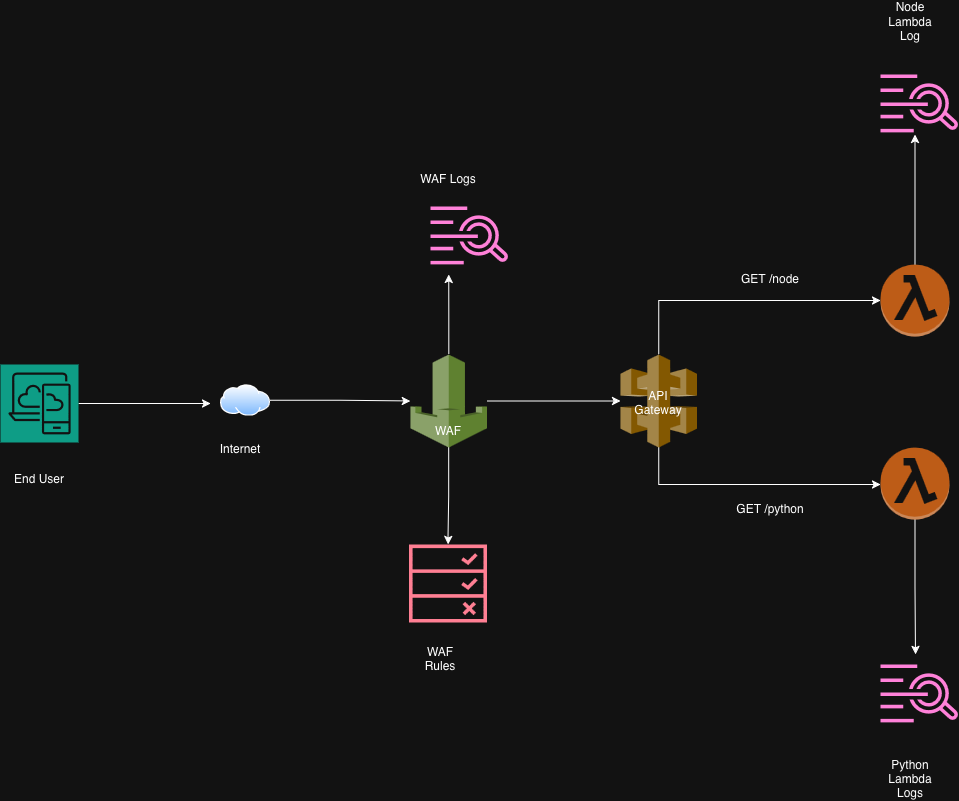
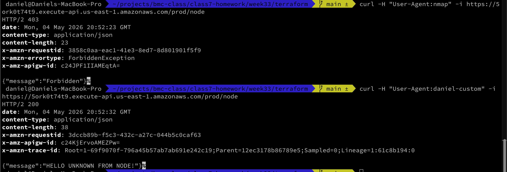

---
tags:
  - BMC
  - AWS
  - homework
  - terraform
  - lambda
  - api-gateway
  - waf
name: Homework Week 34
---

# Overview

This weeks project is to intergrate WAF (web application firewall) with API Gateway. Using a WAF allows us to stop bad traffic before it reaches our API Gateway or backend services.

# Architecture

The WAF sits between the end user/internet and the API gateway. In order for traffic to reach the API gateway and ultimately the lambda functions it must pass the rules associated with the WAF.

The WAF uses the following rules:

- AWS Common Rules
- A rate limiting rule
- A geo location rule that blocks traffic from certain countries

# Deliverables

- [x] Click Ops WAF -> API Gateway Approved Request 1
      
- [x] Click Ops WAF -> API Gateway Approved Request 2
      
- [x] Click Ops WAF -> API Gateway Approved Request 3
      
- [x] Terraform State
      
- [x] WAF Created by Terraform
      

## Be A Man

- [x] Proof of Request Blocked By WAF
      
      [Blocked Request Log Entry](./deliverables/blocked-request-bot.json)
- [x] Overview of blocked request
      The AWSCommonRules Rule Set includes several rules. You can view the list of rules in the console or by checking [here](https://docs.aws.amazon.com/waf/latest/developerguide/aws-managed-rule-groups-baseline.html). One of the rules is `UserAgent_BadBots_HEADER`. This rule evaluates the `User-Agent` header for the presence of values like `nessus` and `nmap`.
- [x] Methodology for triggering blocked request
  1. Find a value that would be considered a bad bot.
  2. Use curl to submit a request that sets the user agent header's value to the bad bot (ex: `curl -H "User-Agent: nmap" -i https://5ork0t74t9.execute-api.us-east-1.amazonaws.com/prod/node`)
  3. Evaluate the CloudWatch logs and the request response to verify that the rule was triggered
  4. Submit a second curl request with a non bad bot user agent (ex: `curl -H "User-Agent:daniel-custom" -i https://5ork0t74t9.execute-api.us-east-1.amazonaws.com/prod/node`)
  5. Evaluate the CloudWatch logs and the request response to verify that the rule was not triggered

# Documentation

[Notes](./docs/notes.md#general-notes)
[Troubleshooting](./docs/notes.md#troubleshooting)
[Resources](./docs/notes.md#resources)
